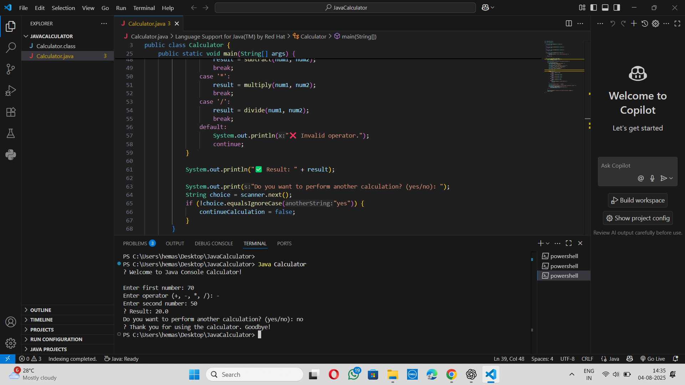

# 🧹 Task 1 – Data Cleaning & Preprocessing  
### Titanic Dataset | AI & ML Internship

## 📘 About the Project  
This project is about preparing data for machine learning using the Titanic dataset. The goal is to clean the raw data and make it suitable for training ML models.

## 🎯 What I Did  
- Loaded the Titanic dataset  
- Removed unnecessary columns  
- Handled missing values (Age, Embarked, etc.)  
- Encoded categorical variables (Sex, Embarked)  
- Normalized numerical features like Age and Fare  
- Saved the cleaned dataset for ML use

## 📦 Dataset Info  
- **Source:** [Kaggle Titanic Dataset](https://www.kaggle.com/c/titanic)  
- **Target Variable:** Survived  
- **Features Used:** Pclass, Sex, Age, SibSp, Parch, Fare, Embarked

## 🛠 Tools & Libraries  
- Python  
- pandas  
- numpy  
- scikit-learn  
- seaborn, matplotlib

## 🖼 Screenshot  

## 📁 Files Included  
- `titanic_preprocessing.ipynb` – Jupyter notebook with code  
- `screenshot.png` – Example output screenshot  
- `README.md` – This file  
- `titanic.csv` – Dataset (or linked from Kaggle)

## 💡 Key Concepts  
- Data cleaning  
- Missing value handling  
- Encoding categorical data  
- Feature scaling  
- Preparing datasets for ML

## 📚 What I Learned  
This task taught me how important clean data is for machine learning. I learned how to fix missing data, convert text into numbers, and prepare features for modeling.

